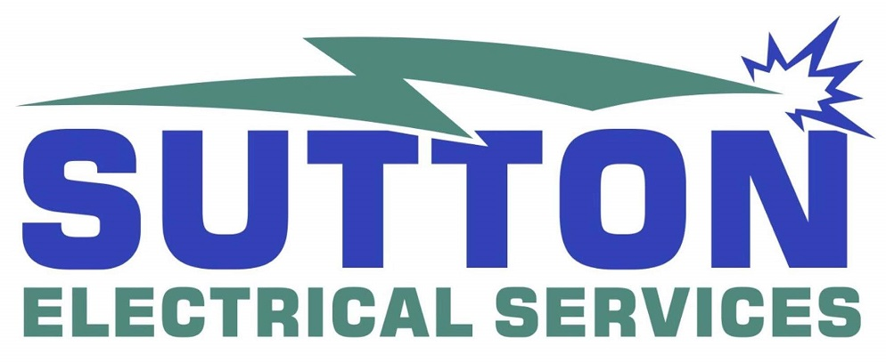

---

# Sutton Electrical Services

---
## Links

### [Aim of the site](#aim)
### [User stories](#userstories)
### [Features](#features)
### [Theme & typography](#theme)
### [Features left to implement](#left)
### [Technologies used](#tech)
### [Testing](#testingsection)
- [Code testing](#code)
- [Manual testing](#manual)
- [User story testing](#usertesting)
- [Screen-size testing](#screen)
### [Deployment](#deploy)
### [Issues & bugs](#issues)
### [Credits & acknowledgements](#credits)

---

## Aim of the site

This is a site for an electricians business based in Suffolk, UK. the idea is for this small business owner to be able to give prospective clients a positive and polished impression of the company.

## [Link to live site](www.sutton-electrical-services.co.uk) opens in same tab, click back if needed

### [Top of page](#top)

## User Stories 

"As a prospective client I want to be given a favourable impression of the level of professionalism and quality of this business"

"As a prospective client I want to understand the services offered by this business"

"As a prospective client I want to be able to contact through a contact us form or a phone number"

"As a prospective client I want to know the geographical area covered by this business"

### [Top of page](#iGrow)
---
## Features

## Features

### All pages: 

All pages will have a header with links to Home, About Us, Services provided page, Portfolio examples and a Contact Us page. the logo will be present and 

All pages will have a footer with a brief About Us overview and links to all pages

### Page 1: Landing page/index.html

As well as the header & footer from above this page will have an About Us section (linked from the "About Us" links in the header & footer). For the duration of Coronavirus there will be a dropdown Bootstrap card detailing the Coronavirus risk mitigation actions. Below this there will be some testemonials from happy customers. 

### Page 2: Services page/services.html

As well as the header & footer, this page will have 3 sections showing what services can be provided by the company (domestic, corporate & general)

### Page 3: Portfolio page/portfolio.html

As well as the header & footer, this page will have 3 examples of previous work completed. Each example will have a carousel of images from the work and a description summary of what was done.

### Page 4: Contact page/contact.html

As well as the header & footer, this page will give the user 3 options of contact. An email link, a phone number and a contact us form.

### [Top of page](#iGrow)
---

## Theme & typography

The site will be clean, simple and easy to use. Will not be too busy, or give the user information overload at any stage.

Chosen font used throughout is Lobster, chosen for the clean, simple and easy to read style.

Colours are designed to convey trust and reliability.

### [Top of page](#iGrow)

---

## Features left to implement

### [Top of page](#iGrow)
---

## Technologies used

- HTML, CSS and Javascript languages
- [Google fonts](https://fonts.google.com/) for Lobster font used through all pages, opens in same tab, press back to return
- [Font awesome](https://fontawesome.com/) for icons, opens in same tab, press back to return
- [Favicon.io](https://favicon.io/) to generate favicon,opens in same tab, press back to return
- [Gitpod](https://www.gitpod.io/) IDE used to code, opens in same tab, press back to return
- [GitHub](https://github.com/) To host the repositories for this project, opens in same tab, press back to return
- [Bootstrap](https://getbootstrap.com/) used as the framework
- [Coolors](https://coolors.co/) used for colour palette, opens in same tab, press back to return
- [Tiny PNG](https://tinypng.com/) used to compress some images used, opens in same tab, press back to return
- [Animate.css](https://animate.style/) used for image effect, opens in same tab, press back to return
- [Wow.css](https://wowjs.uk/) used to trigger the animate.css effects on scroll instead of page load, opens in same tab, press back to return

### [Top of page](#iGrow)
---

## Testing

### Code

- **HTML:** All tested with [W3S HTML Validation Service](https://validator.w3.org/)

1. index.html:
2. services.html:
3. portfolio.html:
4. contact.html:

- **CSS:** style.css tested with [W3C CSS Validation Service](https://jigsaw.w3.org/css-validator/validator), no errors found

- **Javascript:** scripts.js tested with [JSLint](https://jslint.com/), no errors found except for Undeclared '\$', coming from the use of JQuery and negated by adding the use of JQuery as a global variable in JSLint

### Manual Testing

**index.html**

The below items are in index.html and apply to all pages. 

- Tested the logo on the navbar to check that index.html is rendered

Specific to index.html

**services.html**

**portfolio.html**

**contact.html**

### User story testing

Tested against [User Stories](#userstories)

| As a | I want to be able to | Achieved |
| --- | --- | --- |
| Prospective client | I want to be given a favourable impression of the level of professionalism and quality of this business | :thumbsup: |
| Prospective client | I want to understand the services offered by this business | :thumbsup: |
| Prospective client | I want to be able to contact through a contact us form or a phone number | :thumbsup: |
| Prospective client | I want to know the geographical area covered by this business | :thumbsup: |
| |

### Screen size Testing

- Using Chrome dev tools tested all features on;

Moto G4, Galaxy S5, Pixel 2, Pixel 2 XL, iPhone5/SE, iPhone 6/7/8, iPhone 6/7/8 Plus, iPhone X, iPad, iPad Pro, Surface Duo, Galaxy fold

### [Top of page](#iGrow)
---

## Deployment

This site is currently deployed on AWS

### [Top of page](#iGrow)
---

## Issues & bugs

### Closed issues

### Open issues

### [Top of page](#iGrow)
---

## Credits & acknowledgements

- Basic template for header used: [Bootdey Bootstrap Navbar](https://www.mockplus.com/blog/post/bootstrap-navbar-template), and modified to suit
- Contact form from [Freecontactform.com]("https://www.freecontactform.com")
- Basic template for footer used: [uicookies.com](https://uicookies.com/bootstrap-footer/), and modified to suit

### [Top of page](#iGrow)
---

